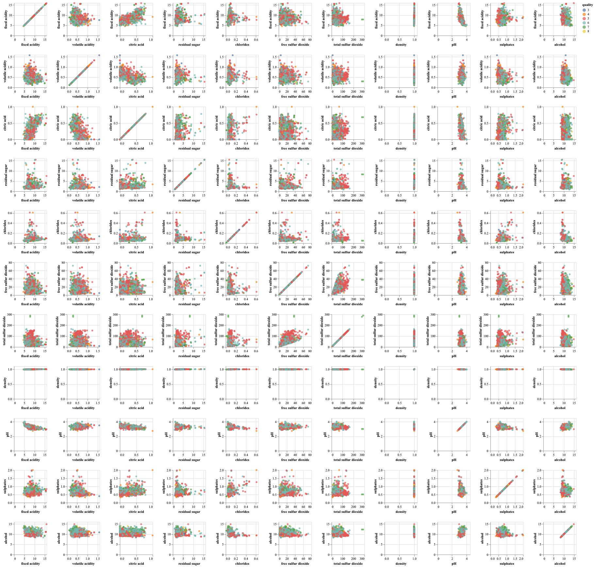

# prepropy 

[](https://github.com/UBC-MDS/prepropy/actions/workflows/deploy.yml) [](https://codecov.io/gh/UBC-MDS/prepropy) [](https://github.com/UBC-MDS/prepropy/actions/workflows/build.yml) [](https://prepropy.readthedocs.io/en/latest/?badge=latest) 

A python package for data preprocessing 

## Overview

Data preprocessing and EDA are essential to any data science project. EDA provides insights into a dataset , visualizes and interprets the information that is hidden in the dataset. Data preprocessing is crucial to get scale features to train better models and handle missing values. In the real world, datasets contain a large number of features and observations and it is unrealistic to expect that raw dataset is perfect and ready for model building. The package aims to facilitate users to perform data imputation, feature scaling and basic exploratory data analysis for machine learning modeling.

## Installation

```bash
$ pip install -i https://test.pypi.org/simple/ prepropy
```

## Features

The package is under development, it will includes following functions:

- Imputer :  Identify and handle missing values in a dataframe
    - A class that does the imputation for missing data
    - Can work on both numerical and categorical data
- Numeric Scaler:  Performs Numerical Feature Scaling 
    - Scale Numerical Features to facilitate seamless building of machine learning pipelines
    - Provide functionality to pick from multiple scaling algorithms
- EDA :  Extract info and Visualize selected features in a dataframe
    - Separate data into train/test dataset
    - Report number of missing data
    - Report feature types (numerical V.S. categorical)
    - Report class imbalance 
    - Investigate the correlation matrix

EDA and data preprocessing are crucial steps to take before diving into any machine learning models. Open-source libraries such as sklearn, pandas, and altair provide functions to perform data scaling, data imputation, descriptive data analysis, and graphing  etc. We are not reinventing the functions but we want to integrate function across the packages and provide a quick overview of the data to users. We hope the package can speed up the data analysis process for our users.

## Dependencies

* python = "^3.8"
* pandas = "^1.2.3"
* numpy = "^1.20.1"
* altair = "^4.1.0"
* vega-datasets = "^0.9.0"
* sklearn = "^0.0"

## Usage

#### `eda()`

The `eda()` function helps to quickly explore the data by showing a pairplot and some summary statistics for a given dataframe .   

These are required imports:  

```{python}
import pandas as pd
from prepropy.eda import eda
```

To see how this function works, we will use the wine-quality dataset from uci.eda    

```{python}
url1 = "https://archive.ics.uci.edu/ml/machine-learning-databases/"
url2 = "wine-quality/winequality-red.csv"
url = url1+url2
df = pd.read_csv(url, ";")
```

After calling the `eda()` function, we can get following outputs,see dir(res) for more available attributes.

```{python}
target = "quality"
res = eda(df,target)
```

```{python}
res["pairplot"]
```



```{python}
res["nb_num_features"]
```

```{python}
11

```

#### `impute()`

The `impute()` function imputates missing values based on imputation requirement parameters.   

These are required imports:  

```{python}
import pandas as pd
import prepropy.imputation import imputation
```

To see how this function works, let's create a toy dataset    

```{python}
test_df = pd.DataFrame([[np.nan,2,3],[2,np.nan,4],[5,6,7]])
```

After calling the `impute()` function, the code generates an instance of imputation class for imputation on missing data

```{python}
 imputer = imputation('mean')
 imputer.fit(test_df)
 new = imputer.fill(test_df)
 print(new)
 ```

```{python}
    0  1   2
0  3.5  2.  3.
1  2.0  4.  4.
2  5.0  6.  7.
```

#### `scaler()`

The `scaler()` function scales numerical features based on scaling requirement parameters.   

These are required imports:  

```{python}
import pandas as pd
from prepropy.eda import eda
```

To see how this function works, let's create a toy dataset  

```{python}
X_train = pd.DataFrame(np.array([['adam', 54, 500],
         ['eve', 45, 6000],['pandaman', 64, 9000]]),
        columns=['name', 'age', 'net_worth'])

X_Valid = pd.DataFrame(np.array([['nurse', 54, 18000],
         ['ddoorman', 87, 2000],
         ['bruman', 100, 400000]]),
        columns=['name', 'age', 'net_worth'])

X_test = pd.DataFrame(np.array([['raconman', 45, 70000],
         ['idkman', 23, 56000],
         ['testman', 12, 81000]]),
        columns=['name', 'age', 'net_worth'])
```

After calling the `scaler()` function, selected features(columns) will be scaled.

```{python}
scaled_data = scaler(X_train,
         X_Valid, X_test,
        ['age', 'net_worth'])
scaled_data
```

```{python}
{'X_train':        name       age net_worth
             0      adam -0.042954 -1.325838
             1       eve -1.202703  0.236757
             2  pandaman  1.245657  1.089082,
 'X_Valid':        name       age   net_worth
             0     nurse -0.042954    3.646056
             1  ddoorman   4.20946   -0.899676
             2    bruman  5.884654  112.175401,
 'X_test':        name       age  net_worth
             0  raconman -1.202703  18.419684
             1    idkman -4.037646  14.442169
             2   testman -5.455117  21.544874}
```
## Documentation

The official documentation is hosted on Read the Docs: https://prepropy.readthedocs.io/en/latest/

## Contributors

|Team Members    | GitHub Username|
|---------------------|-----------|
|Chun Chieh(Jason) Chang | [jachang0628](https://github.com/jachang0628)|
|Bruhat Musunuru | [BruhatM](https://github.com/BruhatM)     |
|Pan Fan       | [pan1fan2](https://github.com/pan1fan2) |

We welcome and recognize all contributions. You can see a list of current contributors in the [contributors tab](https://github.com/UBC-MDS/prepropy/graphs/contributors).

### Credits

This package was created with Cookiecutter and the UBC-MDS/cookiecutter-ubc-mds project template, modified from the [pyOpenSci/cookiecutter-pyopensci](https://github.com/pyOpenSci/cookiecutter-pyopensci) project template and the [audreyr/cookiecutter-pypackage](https://github.com/audreyr/cookiecutter-pypackage).
